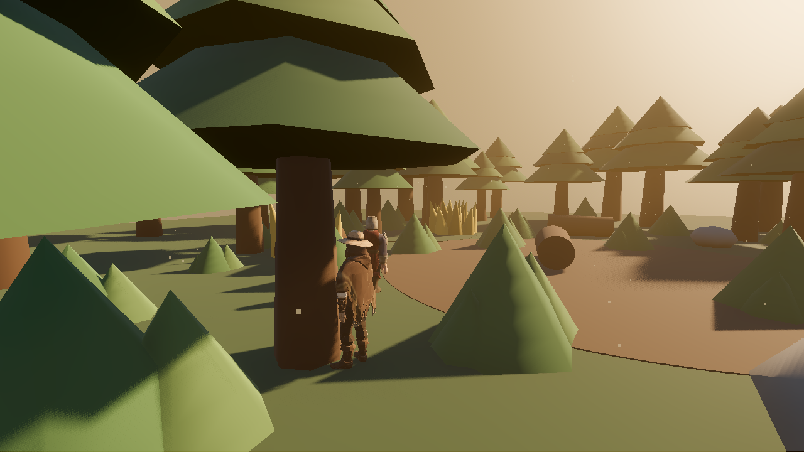
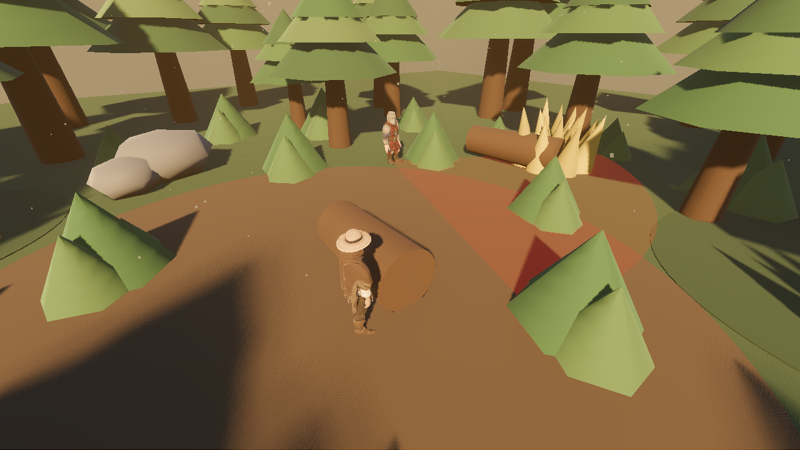
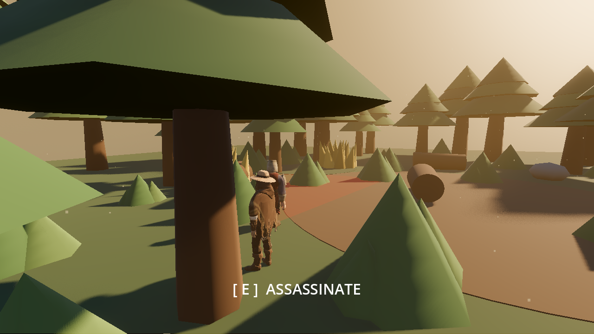
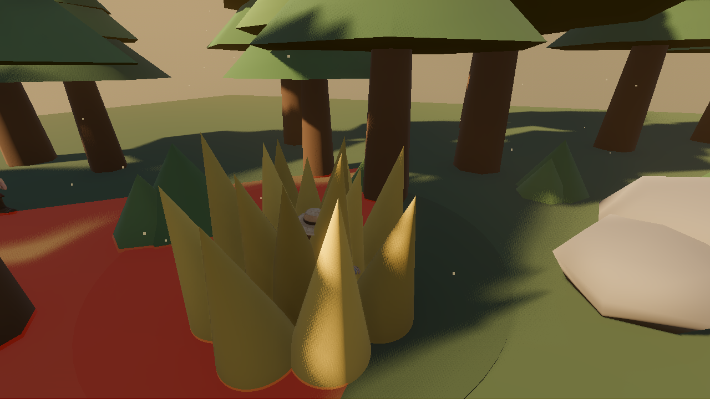
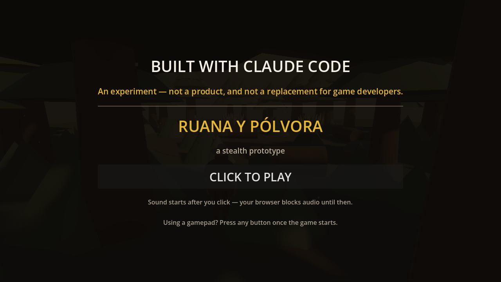

<p align="center">
  
</p>

<h1 align="center">Ruana y Pólvora</h1>

<p align="center">
  <em>Can you build a working game from zero with just Claude Code?</em>
</p>

<p align="center">
  
</p>

---

# The experiment

Not "can AI write some game code" — the whole thing: design, systems, balance,
assets, audio, animation, a web build, deployed.

**Short answer: yes. You can.** This repository is a playable stealth prototype
that did not exist a few days ago.

**Longer answer: you *can*, but if you want a result that's actually good, don't
do it with Claude Code alone.** Combining it with specialized tools is what made
the difference between "a programmer's test scene" and something that looks and
sounds like a game.

---

## What is this

**Ruana y Pólvora** — a stealth prototype set during the Colombian war of
independence. A criollo assassin, a Spanish royalist patrol, a jungle at golden
hour. Built in **Godot 4.7**.

It exists to answer one design question:

> Does approaching a patrolling guard from behind and executing him feel *tense*
> to approach and *satisfying* to pull off?

| | |
|:--|:--|
|  | **Stay out of the cone.** The guard sees in an arc — and *hears* in every direction. Jogging carries 8 m. Crouching, 0.9 m. |
|  | **Get behind him.** A 150° arc, 2.4 m. The lunge closes the rest. |
|  | **Crouch in the tall grass.** No button, no prompt to memorize — the grass breaks his line of sight and crouching drops your eyes below it. |

**Keyboard** — `WASD` move · `Mouse` look · `Shift` jog · `Ctrl`/`C` crouch ·
`E` assassinate · `R` restart · `Esc` menu · `H` cycle HUD

**Gamepad (Xbox)** — Left stick move · Right stick camera · `RT` jog · `B`
crouch · `X` assassinate · `View` restart · `Menu` pause

---

## What Claude Code did on its own

Everything that is code and design:

- Movement, camera, and the whole feel layer
- The guard's AI: patrol, vision cone, **hearing**, suspicion, alert, hunt,
  search, and calming back down
- Stealth balance — the numbers that make each movement mode mean something
- The assassination sequence: slow-motion windup, hit-stop, camera orbit
- HUD, detection indicator, pause menu, subtitles, gamepad support
- Web export pipeline and deployment config
- Four headless test suites

It also used **[Claude Code Game Studios](https://github.com/Donchitos/Claude-Code-Game-Studios)**
— an agent architecture with specialized roles (game designer, gameplay
programmer, Godot specialist, QA) instead of one generic assistant. Having a
*technical director* argue with a *game designer* produces better decisions than
asking one model to be everything at once.

## Where it needed help — and this is the real lesson

Claude Code cannot generate a character model, a motion-captured animation, or a
voice actor. For those, specialized tools did the work:

| need | tool |
|------|------|
| 3D characters | **Meshy** (image-to-3D) |
| Rigging + animation | **Mixamo** |
| Voice and sound effects | **ElevenLabs** |
| Everything else | **Claude Code** |

Without those, this would have been capsules sliding around a grey plane. The
honest takeaway isn't "AI builds games now" — it's **AI is very good at the
parts that are logic, and you still need the right tool for the parts that
aren't.**

---

## Why you still need to verify everything

Every AI-generated piece had to be *measured* before it could be trusted. A few
bugs that only surfaced because something measured them:

- **The hidden blade was 15.4 metres away from its own hand.** A
  `BoneAttachment3D` lives in skeleton space; the mesh scale was compensated,
  the position wasn't. You never saw the weapon — your brain filled in a knife
  that was never there.
- **An animation clip reported 239 m/s** (863 km/h). It had been downloaded
  against a different character and came in that character's units, ~93× off.
- **The guard had no ears.** Only a vision cone. You could sprint at his back
  and nothing happened.
- **The game was mathematically unwinnable.** Crouch speed ended up at exactly
  the guard's patrol speed — closing distance was not hard, it was *impossible*.
  Every unit test was green.

That last one is the point. Green tests on isolated pieces prove nothing about
whether the game works. The suite now includes **cross-system invariants**:

- no movement state may out-run the animation clip that sells it
- crouch and walk must out-pace the guard
- walking must reach range, but **not for free**
- jogging must **never** work — otherwise nobody would ever crouch

A test that asserts something must *fail* is often the one protecting the design.

---

## This does not replace a game developer

It needs saying plainly — and the web build says it before you can even press
play:

<p align="center">
  
</p>

A professional wouldn't have shipped the blade 15 metres away, wouldn't have set
crouch speed to the guard's exact speed, and would have known a vision cone
without hearing is half a stealth system. Every one of those was caught by
playing it and asking "why does this feel wrong?" — a human judgment call that
no test wrote for itself.

What AI changed is the **cost of trying**. A prototype like this used to mean
weeks and a small team. Now one person can ask a design question and have a
playable answer in days. That's a real shift — but the person still has to know
what to ask, and has to recognize when the answer is wrong.

This was an experiment. It was also genuinely fun.

---

## Running it

```bash
godot --path .                                         # play
bash build_web.sh                                      # export web build
python serve_web.py                                    # local test at :8000
```

Tests (no hardware needed):

```bash
godot --headless --path . --script verify_locomotion.gd
godot --headless --path . --script verify_detection.gd
godot --headless --path . --script verify_gamepad.gd
godot --path . --script verify_menu.gd
```

> On web, only the `gl_compatibility` renderer exists, so SSAO and volumetric fog
> are unavailable — the game detects this at runtime and compensates. And
> `python -m http.server` will **not** work: without cross-origin isolation Godot
> can't use `SharedArrayBuffer` and boots to a black screen. `vercel.json` ships
> the right headers.

---

*Throwaway prototype. Standards are deliberately relaxed for speed — this code
exists to answer a design question, not to ship.*
